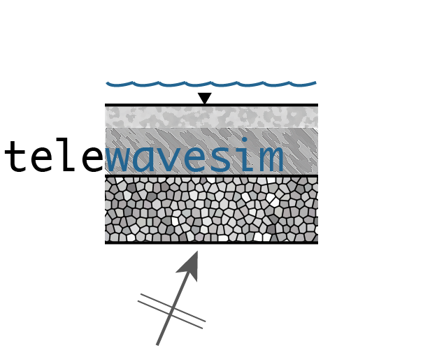

# Telewavesim: Python software for teleseismic body wave modeling



The structure of the Earth's crust and upper mantle give useful information on the 
internal composition and dynamics of our planet. Some of the most widely used techniques
to infer these properties are based on examining the effect of teleseismic body wave 
(i.e., P and S waves that originate from distant earthquakes and arrive as plane waves)
propagation (e.g., transmission and scattering) through stratified media. Modeling the 
seismic response from stacks of subsurface layers is therefore an essential tool in 
characterizing their effect on observed seismograms.

This python package contains modules to synthesize teleseismic body-wave propagation through
stacks of generally anisotropic and strictly horizontal layers using the
matrix propagator approach of [Kennett (1983)](#references). The software also properly models 
reverberations from an overlying column of water, effectively simulating ocean-bottom 
seismic (OBS) station recordings. The software will be useful in a variety of 
teleseismic receiver-based studies, such as P or S receiver functions,
long-period P-wave polarization, shear-wave splitting from core-refracted shear waves 
(i.e., SKS, SKKS), etc. Common computational workflows are covered in the Jupyter notebooks bundled with this package.

## Navigation / Notebooks

Included in this package is a set of Jupyter Notebooks, which give examples on how to call the various routines and obtain plane wave seismograms and receiver functions. Selecting the Fortran implementation provides much faster run times and may be the starting point for stochastic inverse methods. The Notebooks desribe how to reproduce published examples of synthetic data from [Audet (2016)](#references) and [Porter et al. (2011)](#references).

- [sim_obs_Audet2016.ipynb](./examples/Notebooks/sim_obs_Audet2016.ipynb): Example plane wave seismograms and P receiver functions for OBS data from [Audet (2016)](#Audet).
- [sim_Prfs_Porter2011.ipynb](./examples/Notebooks/sim_Prfs_Porter2011.ipynb): Example P receiver functions from [Porter et al. (2011)](#Porter)
- [sim_SKS.ipynb](./examples/Notebooks/sim_SKS.ipynb): Example plane wave seismograms for SKS splitting studies.

## Installation

### Dependencies

The current version was developed using **Python3.7**
Also, the following packages are required:

- [`obspy`](https://github.com/obspy/obspy/wiki)
- [`pyfftw`](https://pyfftw.readthedocs.io/en/latest/)
- [`fftw`](http://www.fftw.org)

By  default, both `numpy` and `matplotlib` are installed as dependencies of `obspy`. 
See below for full installation details.

### Conda installation

We advise creating a custom [conda environment](https://conda.io/docs/user-guide/tasks/manage-environments.html)
where `telewavesim` can be installed along with its dependencies. 

Clone the repository:
```bash
git clone https://github.com/paudetseis/Telewavesim.git
cd Telewavesim
```

Create a new environment and install all dependencies:
```bash
conda create -n tws python=3.7 obspy pyfftw -c conda-forge
```
or create it from the `tws_env.yml` file:
```bash
conda env create -f tws_env.yml
```
Activate the newly created environment:
```bash
conda activate tws
```

### Fortran compilation and `fftw` library

You can further use `conda` to install the required Fortran compiler and the `fftw` library. This is the default installation, as the `os.environ` points to the `tws` environment library for dynamic linking. In this case, install `gfortran` and `fftw` using `conda`. On a MacOSX, the `gfortran` package is `gfortran_osx-64`; for Linux, the `gfortran` package is `gfortran_linux-64` (check out https://anaconda.org/search?q=gfortran for the available packages):

```bash
conda install gfortran_osx-64 fftw
```

You can check that the active Fortran compiler resides in the `tws` environment:
```bash
which gfortran
```

#### Separate Fortran build

If you wish to use a different Fortran compiler available system-wide (e.g., Intel Fortran installed in `/usr/local/bin`), you will need to independently download and install the `fftw` library (http://www.fftw.org), then edit the `setup.py` file to modify the content of `extra_link_args` in the `Extension` class to point to the location of your compiled `fftw3` library. In the example below the library is installed in `/usr/local/lib`:

```python
ext = [Extension(name='telewavesim.rmat_f',
                 sources=['src/rmat.f90', 'src/rmat_sub.f90'],
                 extra_f90_compile_args=["-O3"],
                 extra_link_args=["-L/usr/local/lib", "-lfftw3"])]
```

### Option 1) Installing using pip

Once the previous steps are performed, you can install `telewavesim` using pip:
```bash
pip install .
```

### Option 2) Building and Installing

Alternatively, you can build and install the project:

```bash
python setup.py build 
python setup.py install
```

---
**NOTE**

If you are actively working on the code, or making frequent edits, it is advisable to perform 
the ``pip`` installation with the `-e` flag: 
```bash
pip install -e .
```

This enables an editable installation, where symbolic links are used rather than straight 
copies. This means that any changes made in the local folders will be reflected in the 
package available on the system.

---

## References
1. Audet, P. (2016). Receiver functions using OBS data: promises and limitations from numerical modelling and examples from the Cascadia Initiative. Geophysical Journal International, 205, 1740-1755. https://doi.org/10.1093/gji/ggw111
2. Kennett, B.L.N. (1983). Seismic wave propagation in stratified media. Cambridge University Press, 342pp.
3. Porter, R., Zandt, G., & McQuarrie, N. (2011). Pervasive lower-crustal seismic anisotropy in Southern California: Evidence for underplated schists and active tectonics. Lithosphere, 3(3), 201-220. https://doi.org/10.1130/L126.1
